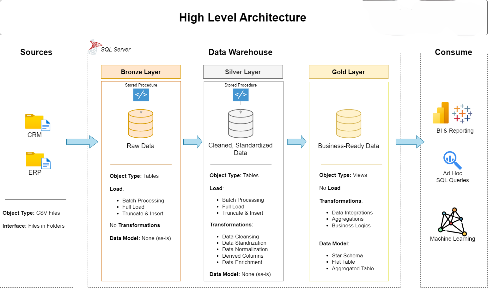
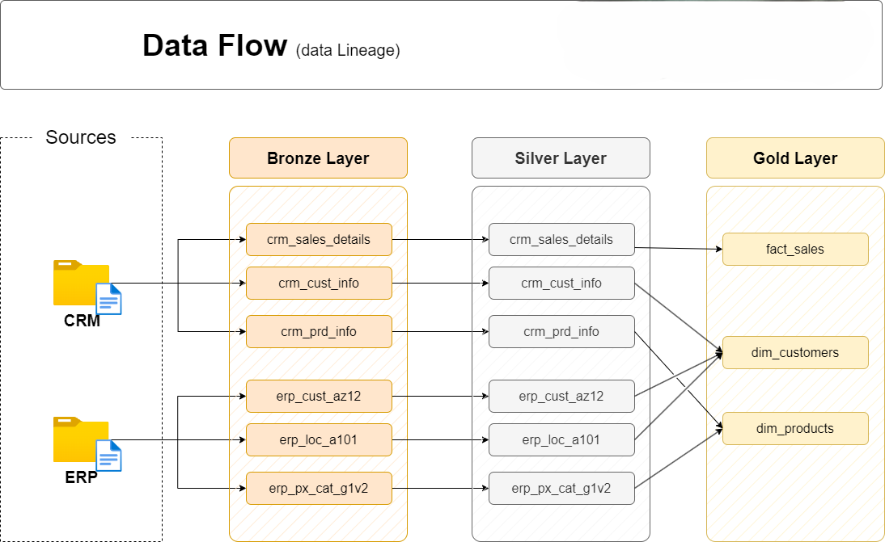
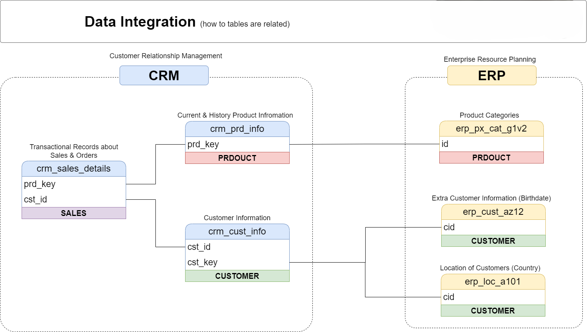

# Fortis-Style SQL Data Warehouse & Integrated Analytics Project

## Overview

This project implements an **end-to-end SQL Server data warehouse** using a **Bronze → Silver → Gold** architecture, followed by an **Integrated Analytics layer** that consumes the Gold datasets as a governed source of truth.

The solution is designed to reflect a **real-world ERP/CRM analytics workflow** in a commercial wholesale environment, closely aligned with the responsibilities of an entry-level **Data Analyst** at Fortis.

Key focus areas:
- Customer and product mapping across CRM and ERP systems  
- Strong data quality controls before reporting  
- Reporting-ready dimensional models optimised for SQL and Power BI  
- Clear separation between data engineering and analytics consumption  

---

## High-Level Architecture

The diagram below shows the **overall system architecture**, from source ingestion through to analytics and reporting consumption.

**Architecture summary:**
- **Source systems**: CRM and ERP extracts (CSV format)  
- **Bronze layer**: Raw data ingestion with full traceability  
- **Silver layer**: Cleansed, standardised, and validated data  
- **Gold layer**: Business-ready dimensional model (facts & dimensions)  
- **Integrated Analytics**: Dedicated analytics database consuming Gold data  
- **Consumption**: Power BI dashboards and ad-hoc SQL analysis  

This layered design ensures **data quality, auditability, and analytical confidence**.

---

## Data Flow & Lineage

The following diagram illustrates **data lineage** across the warehouse layers.

**Key principles:**
- CRM and ERP datasets are ingested independently  
- Data quality rules are enforced in the Silver layer  
- Only validated data is promoted to the Gold layer  
- Clear lineage simplifies debugging, auditing, and enhancements  

---

## Customer & Product Integration

Accurate customer and product mapping is essential for operational reporting and analytics.

**Integration approach:**
- CRM provides transactional sales data  
- ERP enriches customers and products with master data  
- Business rules resolve mismatches and missing keys  
- A single, trusted customer and product view is created  

Detailed mapping logic is documented here:
- [`docs/mapping_rules.md`](docs/mapping_rules.md)

---

## Data Quality & Governance

Data quality checks are implemented **before reporting and analytics consumption**.

Examples of implemented validations:
- Negative or zero quantities  
- Invalid or negative pricing  
- Missing customer or product keys  
- Referential integrity violations  
- Sales amount variance vs quantity × price  

SQL implementations:
- Silver layer checks: `sql/warehouse/06_quality_checks_silver.sql`  
- Gold layer checks: `sql/warehouse/07_quality_checks_gold.sql`  
- Append-only DQ history: `sql/warehouse/08_dq_report_gold.sql`  

All checks are **non-blocking** and designed to surface issues transparently.

---

## Gold Layer – Sales Data Mart

The Gold layer is modelled using **dimensional modelling best practices**.

📎 Detailed schema:
- [`docs/reference/data_model.png`](docs/reference/data_model.png)

**Characteristics:**
- Star-schema-style design  
- Customer and product dimensions  
- Central sales fact table  
- Surrogate keys and conformed dimensions  
- Reject handling for unmapped records  

This structure supports both **BI tools** and **ad-hoc SQL analysis**.

---

## Integrated Analytics Layer

A dedicated analytics database (`DataWarehouseAnalytics`) consumes the warehouse Gold layer.

**Design principles:**
- No CSV reloads in analytics  
- Analytics always reflect the latest Gold data  
- Clear separation between warehouse and consumption layers  

Objects created:
- `analytics_gold.vw_dim_customers`  
- `analytics_gold.vw_dim_products`  
- `analytics_gold.vw_fact_sales`  

These views serve as the foundation for all analytical queries and reports.

---

## Reporting & Analysis

Analytics scripts explore and analyse sales, customers, and products, including:
- Sales trends over time  
- Top and bottom performing products  
- Customer segmentation and contribution  
- Part-to-whole and cumulative analyses  

Final reporting views:
- `report.vw_customers`  
- `report.vw_products`  

These views are designed for **Power BI consumption** and stakeholder reporting.

---

## Power BI Reporting (Gold Consumption)

The Gold layer is consumed through **Power BI dashboards** that demonstrate
how governed data is delivered to business users.

### Customer Master Dashboard

### Product Performance Dashboard

### Data Quality Monitoring

---

## How to Run the Project

Full execution instructions are provided here:
- [`RUN_ORDER.md`](run/RUN_ORDER.md)

The recommended approach is a **single SQLCMD run** in SSMS that:
- Builds all warehouse layers  
- Executes ETL procedures  
- Runs data quality checks  
- Builds the integrated analytics layer  

---

## Supporting Documentation

Additional reference materials:
- Naming standards: [`docs/reference/naming_conventions.md`](docs/reference/naming_conventions.md)  
- Mapping rules: [`docs/mapping_rules.md`](docs/mapping_rules.md)  
- ETL concepts: [`docs/reference/ETL.png`](docs/reference/ETL.png)  

These documents provide depth without cluttering the main narrative.

---

*Prepared as part of a targeted application for Fortis (Timaru, Canterbury).*  
